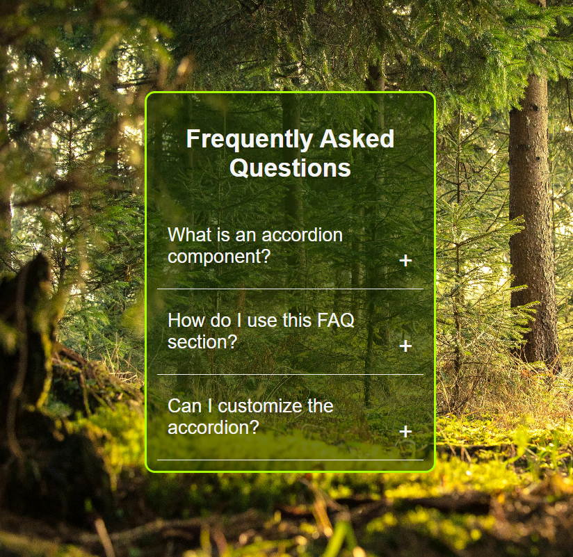

# Accordion FAQ Project

A simple, stylish FAQ accordion component built with HTML, CSS, and JavaScript.

## Features
- Clean and modern UI
- Click to expand/collapse answers
- Smooth transitions and animations
- Responsive design
- Easy to customize questions and answers

## Demo
### Collapsed State


### Expanded State


## How to Use
1. Clone or download this repository.
2. Open `main.html` in your browser.
3. Click on any question to reveal or hide the answer.

## Project Structure
```
Accordion/
├── main.html
├── script.js
├── image1.png
└── image2.png
```

## Customization
- Edit `main.html` to add or change questions and answers.
- Update the CSS in the `<style>` tag for your preferred look.
- Modify `script.js` to change the accordion behavior if needed.

## License
This project is for learning and personal use. Feel free to modify and share!
