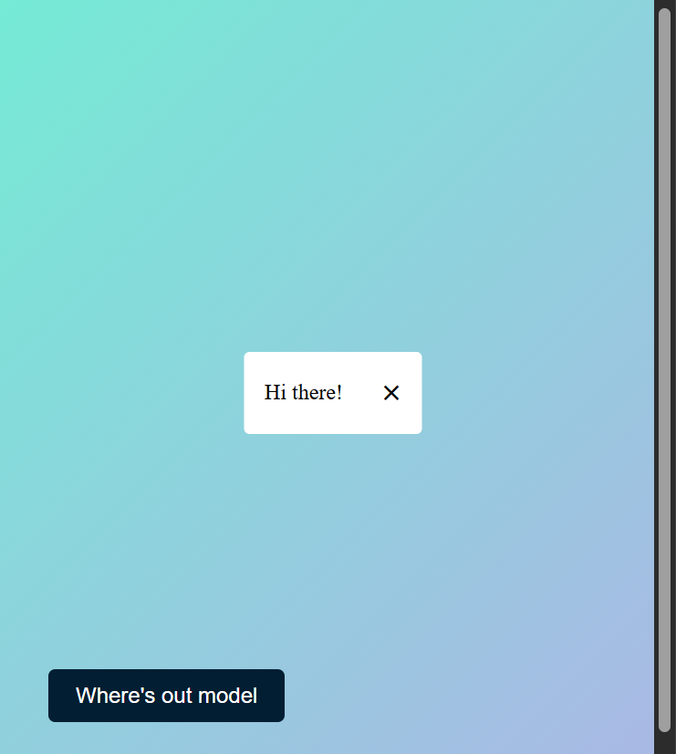

# DisplayHiddenContent

A simple web project to display hidden content on a page using HTML, CSS, and JavaScript.

## Features
- Clean and minimal UI
- Button to reveal or hide hidden content
- Responsive design
- Easy to customize for your own use

## Demo



## How It Works
- The page displays a button.
- When the button is clicked, hidden content is revealed or toggled.

## Usage
1. Clone or download this repository.
2. Open `index.html` (or the main HTML file) in your browser.
3. Click the button to show or hide the hidden content.

## Example Structure
```
DisplayHiddenContent/
├── index.html
├── styles.css
├── script.js
└── image.png
```

## Customization
- Edit the HTML to change the content.
- Update the CSS for your preferred styles.
- Modify the JavaScript to change the toggle behavior.

## License
This project is for learning and personal use. Feel free to modify and share!
