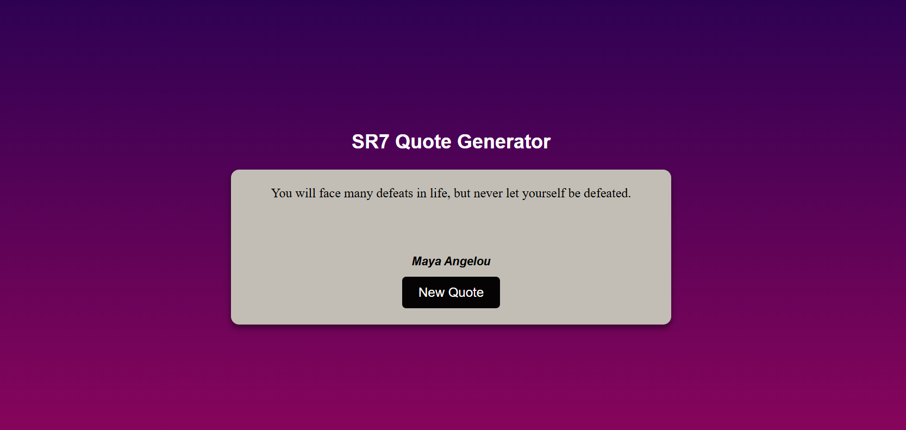

# SR7 Quote Generator

A simple and beautiful random quote generator web app built with HTML, CSS, and JavaScript.

## Features
- Responsive design with a modern gradient background
- Random quote display with author
- Button to generate a new quote
- Clean and minimal UI

## Demo


## How to Use
1. Clone or download this repository.
2. Open `main.html` in your web browser.
3. Click the **New Quote** button to see a new random quote.

## Project Structure
```
SR7Audios/
└── MiniProjects/
    └── Quotes_Generator/
        ├── main.html
        ├── script.js
        └── image.png
```

## Customization
- Add your own quotes and authors in `script.js`.
- Modify styles in the `<style>` section of `main.html` for a personalized look.

## License
This project is for learning and personal use. Feel free to modify and share!
