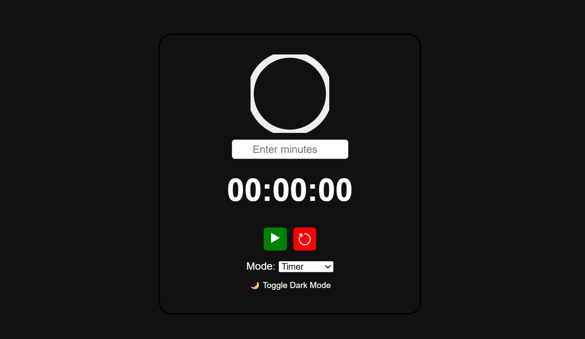
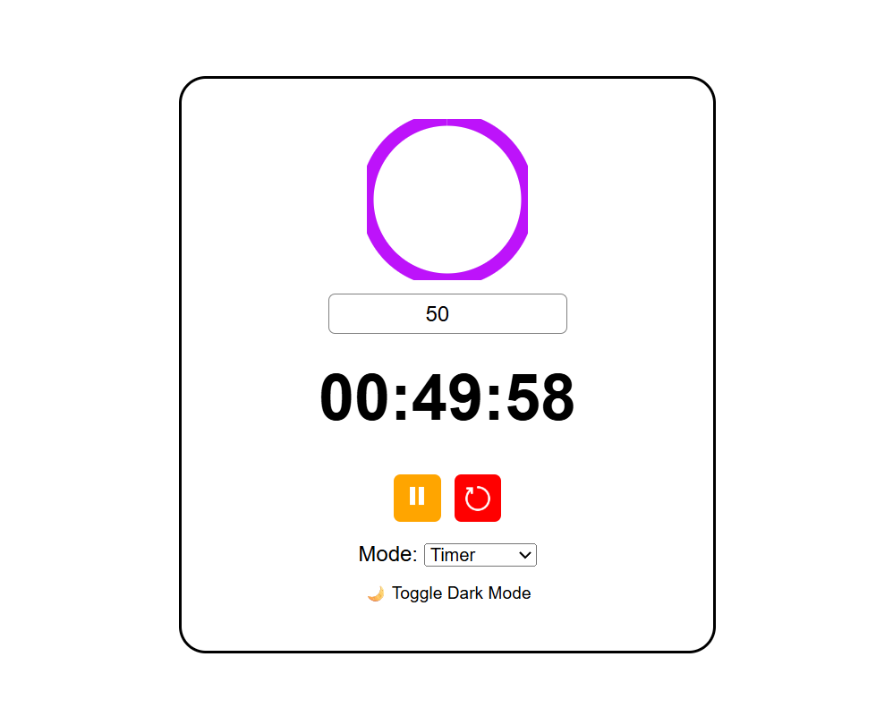

# ⏱ Stopwatch & Timer Web App

An interactive web-based stopwatch and countdown timer with dark mode, lap recording, sound/vibration alerts, and a visual progress ring.

---

## ✨ Features

- ⏱ **Stopwatch Mode** with lap support  
- ⏲ **Timer Mode** with visual countdown ring  
- 🎯 **Lap Time Recording** (double-click the timer)  
- 🔕 **Sound and Vibration** when the timer ends  
- 🌗 **Dark Mode Toggle**  
- 🌀 **Animated SVG Progress Ring**  
- 🎮 **(Optional)** Arcade-style animated background (GIF)

---

## 📸 Screenshots

### 🌙 Dark Mode


### 🔆 Light Mode


### ⏳ Timer Running


---

## 🚀 How to Use

1. Clone or download the repo:
   ```bash
   git clone https://github.com/your-username/stopwatch-timer.git
   cd stopwatch-timer
